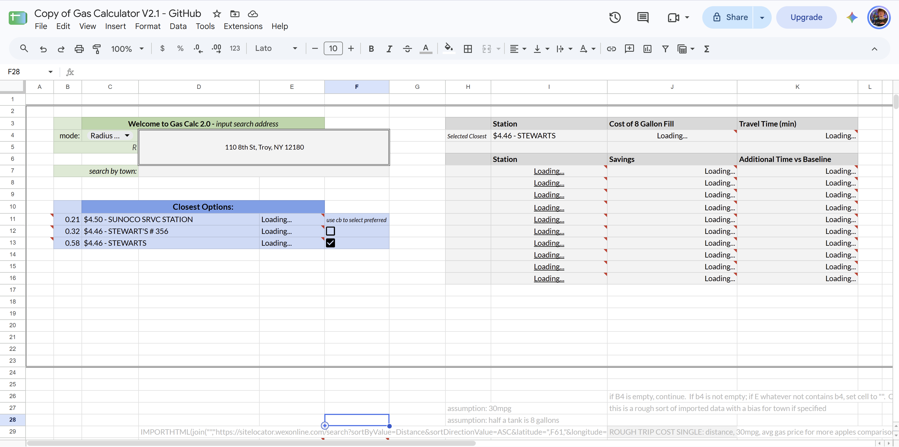

# gas-station-optimizer
Gathers daily-updating gas station pricing info around a specified address, and processes data into an easily viewable format for users to make an informed gas purchasing decision.

[Open a copy on Google Sheets](https://docs.google.com/spreadsheets/d/1QfGbEa5is4c-rPP0q9vdIrZ4piXZ24dqMHKO9edFhso/copy)

**How it works:**
- Station data sourced from [sitelocator.wexonline.com](sitelocator.wexonline.com)
- Google Maps API calls through Apps Script courtesy of [Amit Agarwal](https://www.labnol.org/about) and his personal work on [Labnol.org](https://www.labnol.org/google-maps-sheets-200817)
- Top station selected based on proximity to user, remainder of stations ordered based on gas price
- Cost savings/losses and time gained/lost vs top station displayed to user, allowing for an informed decision
- Hyperlink provided for instant Google Maps directions from current location to selected station

Demo: the screenshot or GIF, near the top.
How it works: a short paragraph, or 3 to 5 bullets covering the data source, the API call, and how stations are ranked.
How to use or run: for Snake, python snake.py with WASD plus Enter. For the sheet, the make-a-copy link and where to enter the API key.
Design decisions: this is where the v1 to v2 redesign goes (the $/hr input replaced with a transparent time-vs-savings display). Two or three sentences on what you changed and why.
Limitations and next steps: for Snake, "turn-based input; real-time loop planned." For the sheet, anything that breaks, like the source site changing its table layout.

